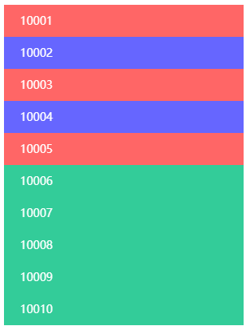

/* 使用:nth-child()筛选指定元素设置样式.css */

/* 表格分栏布局 */

```scss
.specified-scope {
	width: 300px;
	li {
		padding: 0 20px;
		height: 40px;
		line-height: 40px;
		color: #fff;
		&:nth-child(odd) {
			background-color: $red;
		}
		&:nth-child(even) {
			background-color: $purple;
		}
		&:nth-child(n+6) {
			background-color: $green;
		}
	}
}

```

