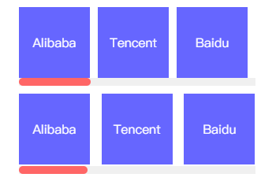

/* 使用overflow-x排版横向列表 */


### overflow-x

visible| hidden | scroll | auto

```scss
.horizontal-list {
	overflow: hidden;
	width: 300px;
	height: 100px;
	ul {
		overflow-x: scroll;
		cursor: pointer;
		&::-webkit-scrollbar { // 滚动条的高度
			height: 10px;
		}
		&::-webkit-scrollbar-track { // 滚动条的样式
			background-color: #f0f0f0;
		}
		&::-webkit-scrollbar-thumb { // 滚动模块的样式
			border-radius: 5px;
			background-color: $red;
		}
	}
	li {
		overflow: hidden;
		margin-left: 10px;
		height: 90px;
		background-color: $purple;
		line-height: 90px;
		text-align: center;
		font-size: 16px;
		color: #fff;
		&:first-child {
			margin-left: 0;
		}
	}
}
.flex {
	ul {
		display: flex;
		flex-wrap: nowrap;
		justify-content: space-between;
	}
	li {
		flex-shrink: 0;
		flex-basis: 90px;
	}
}
.inline {
	margin-top: 10px;
	height: 102px;
	ul {
		overflow-y: hidden;
		white-space: nowrap;
	}
	li {
		display: inline-block;
		width: 90px;
	}
}
```
