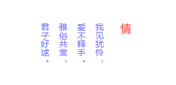

/* 使用writing-mode排版竖文 */

通过writing-mode 调整文本方向

**竖文，文言文**

writing-mode:

> Default value horizontal-tb

> Value horizontal-tb | vertical-rl | vertical-lr

```scss
.vertical-text {
	writing-mode: vertical-rl;
	h3 {
		padding-left: 20px;
		font-weight: bold;
		font-size: 18px;
		color: $red;
	}
	p {
		line-height: 30px;
		color: $purple;
	}
}
```

