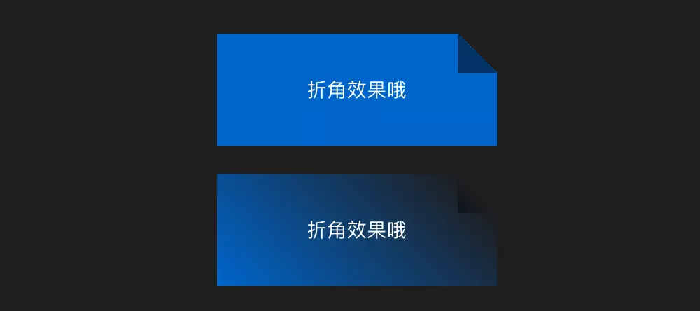

/* 内阴影这点效果.md*/

### 内阴影这点效果.md


```scss
<style>
.fold{
  margin-left: auto;
  margin-right: auto;
  margin-bottom: 20px;
  width: 200px;
  height: 80px;
  color: #fff;
  line-height: 80px;
  text-align: center;
  background: linear-gradient(to left bottom,transparent 50%,rgba(0,0,0,.5) 0) no-repeat 100% 0 / 2em 2em,
              linear-gradient(-135deg,transparent 1.4em,#06c 0);
}
.linear{
  background: linear-gradient(to left bottom,transparent 50%,rgba(0,0,0,.5)) no-repeat 100% 0 / 2em 2em,
              linear-gradient(-135deg,transparent 1.4em,#06c);
}
</style>
<div class="fold">折角效果哦</div>
<div class="fold linear">折角效果哦</div>

// 2
<style>
.fold-1{
  margin-left: auto;
  margin-right: auto;
  margin-bottom: 20px;
  position: relative;
  width: 200px;
  height: 80px;
  border-radius: .5em;
  color: #fff;
  line-height: 80px;
  text-align: center;
  background: linear-gradient(-150deg,transparent 1.5em, #58a 0);
}
.fold-1::before{
  content: "";
  position: absolute;
  top: 0;
  right: 0;
  background: linear-gradient(to left bottom,transparent 50%,rgba(0,0,0,.2) 0,rgba(0,0,0,.4)) 100% 0 no-repeat;
  width: 1.73em;
  height: 3em;
  transform: translateY(-1.3em) rotate(-30deg);
  transform-origin: bottom right;
  border-bottom-left-radius: inherit;
  box-shadow: -.2em .2em .3em -.1em rgba(0,0,0,.15);
}

</style>
<div class="fold-1">折角效果哦</div>


```




